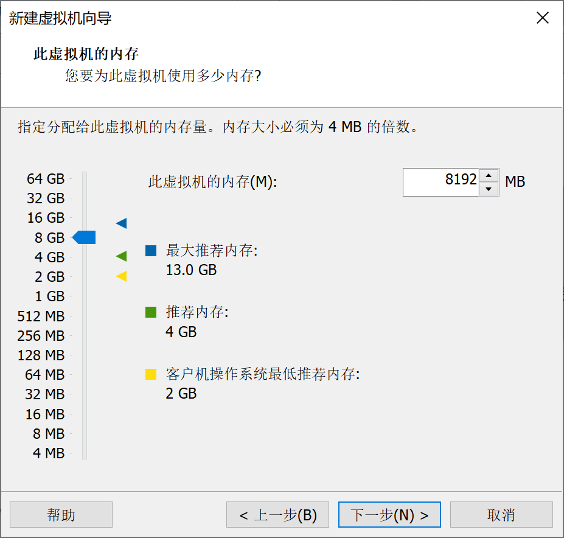
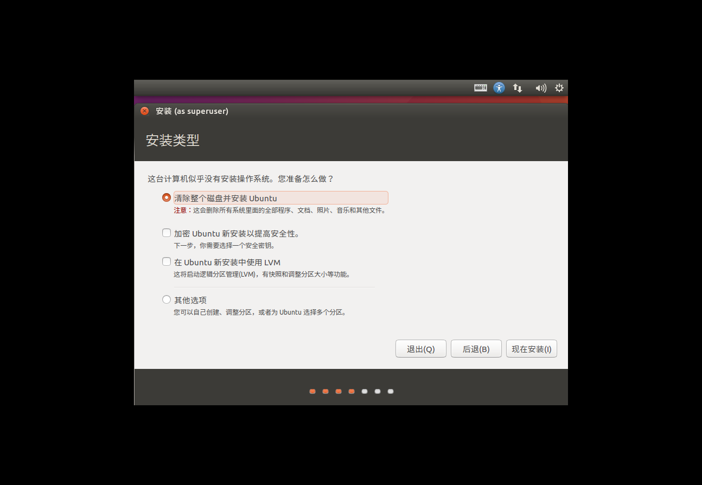
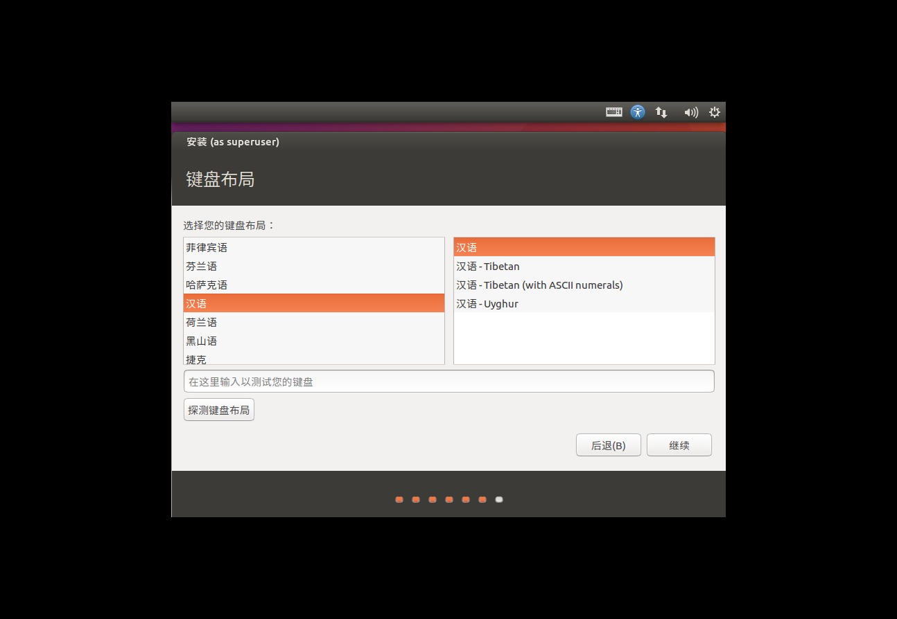

# 开发用Ubuntu 16.04 X64 LTS虚拟机环境准备(1)

更新时间：2021-08-21

## 一、基本信息

### 1、虚拟机软件

```
VMware-workstation-full-15.5.6-16341506.exe
```

### 2、安装介质

```
ubuntu-16.04.7-desktop-amd64.iso
```

### 3、用户名/密码

```
skyhigh/highsky
```

### 4、国内更新源信息

将以下内容存为sources.list，可以使用UltraISO做光盘镜像方式导入

```
# 默认注释了源码镜像以提高 apt update 速度，如有需要可自行取消注释
deb https://mirrors.tuna.tsinghua.edu.cn/ubuntu/ xenial main restricted universe multiverse
# deb-src https://mirrors.tuna.tsinghua.edu.cn/ubuntu/ xenial main restricted universe multiverse
deb https://mirrors.tuna.tsinghua.edu.cn/ubuntu/ xenial-updates main restricted universe multiverse
# deb-src https://mirrors.tuna.tsinghua.edu.cn/ubuntu/ xenial-updates main restricted universe multiverse
deb https://mirrors.tuna.tsinghua.edu.cn/ubuntu/ xenial-backports main restricted universe multiverse
# deb-src https://mirrors.tuna.tsinghua.edu.cn/ubuntu/ xenial-backports main restricted universe multiverse
deb https://mirrors.tuna.tsinghua.edu.cn/ubuntu/ xenial-security main restricted universe multiverse
# deb-src https://mirrors.tuna.tsinghua.edu.cn/ubuntu/ xenial-security main restricted universe multiverse

# 预发布软件源，不建议启用
# deb https://mirrors.tuna.tsinghua.edu.cn/ubuntu/ xenial-proposed main restricted universe multiverse
# deb-src https://mirrors.tuna.tsinghua.edu.cn/ubuntu/ xenial-proposed main restricted universe multiverse
```

## 二、系统安装

### 1、建立虚拟机





### 2、配置虚拟机硬件


### 3、Ubuntu安装








## 三、系统配置

### 1、变更软件源地址并更新

```
sudo mv /etc/apt/source.list /etc/apt/source.list.old
sudo cp source.list /etc/apt
sudo chmod 664 /etc/apt/source.list

sudo apt-get update
sudo apt-get upgrade
```

### 2、安装VMware Tools


### 3、调整dash为bash

提高脚本兼容性

```
sudo dpkg-reconfigure dash
```


### 4、增加i386架构支持

兼容32位运行环境

```
sudo dpkg --add-architecture i386
sudo apt-get update
```

