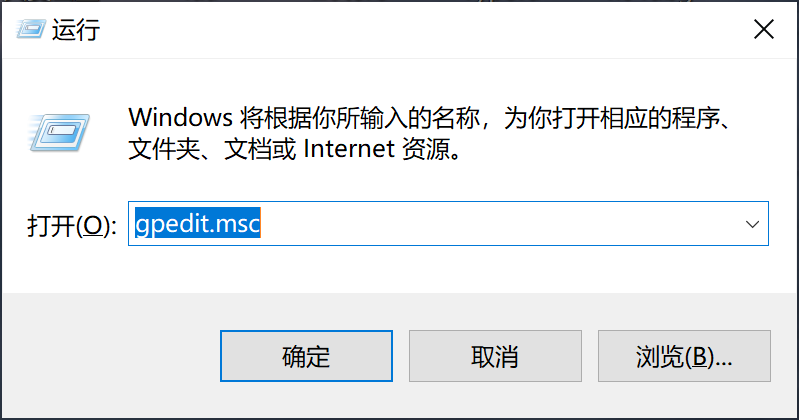
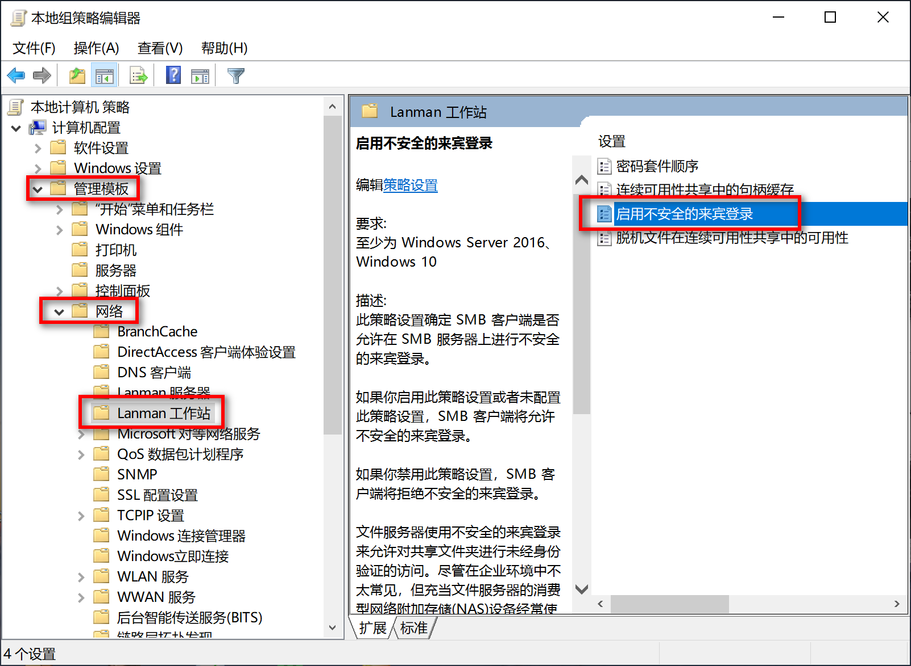
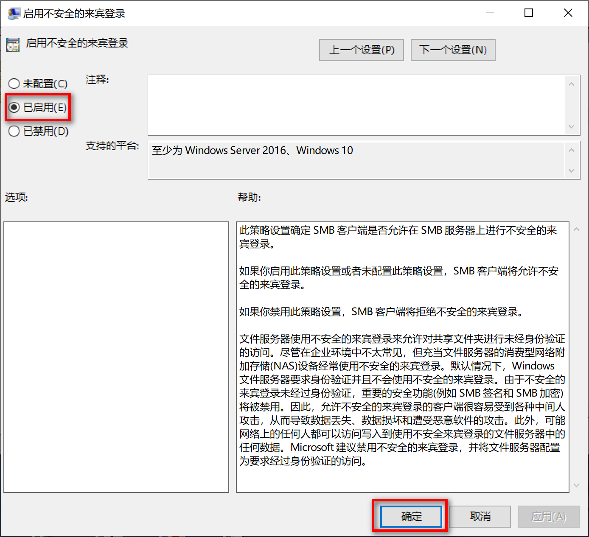

# 开发用Ubuntu 16.04 X64 LTS虚拟机环境准备(2)

更新时间：2021-10-09

### 5、安装软件包

C#环境(支持目前基于qmake的sdk编译)

```
sudo apt-get install flex
sudo apt-get install bison
sudo apt-get install mono-complete
```

#### Linux内核编译

```
sudo apt-get install libncurses5-dev
sudo apt-get install libssl-dev
```

#### WindRiver开发环境依赖

```
sudo apt-get install libstdc++6:i386 libgtk2.0-0:i386 libxtst6:i386 libxt6:i386
sudo apt-get install gtk2-engines-murrine:i386 libcanberra-gtk-module:i386 unity-gtk2-module:i386
sudo apt-get install overlay-scrollbar-gtk2:i386 libatk-adaptor:i386 libgail-common:i386
sudo apt-get install libpangox-1.0-0:i386 libpangoxft-1.0-0:i386
sudo apt-get install gvfs-backends:i386 libsmbclient:i386 samba-libs:i386 python-talloc:i386
```

#### Yocto基础依赖

```
sudo apt-get install gawk wget git-core diffstat unzip texinfo gcc-multilib build-essential chrpath socat libsdl1.2-dev
```

#### Yocto i.MX依赖

```
sudo apt-get install libsdl1.2-dev xterm sed cvs subversion coreutils texi2html docbook-utils python-pysqlite2 help2man make gcc g++ desktop-file-utils libgl1-mesa-dev libglu1-mesa-dev mercurial autoconf automake groff curl lzop asciidoc u-boot-tools
```

#### openssh-server(SSH服务)

```
sudo apt-get install openssh-server
```

#### lftp(sftp命令行客户端)

```
sudo apt-get install lftp
```

#### filezilla(ftp图形界面客户端)

```
sudo apt-get install filezilla
```

#### privoxy(socks5代理转发)

```
sudo apt-get install privoxy
sudo gedit /etc/privoxy/config
```

```
listen-address 127.0.0.1:10809
forward-socks5 / 127.0.0.1:10808 .
```

```
sudo /etc/init.d/privoxy start
sudo /etc/init.d/privoxy restart
```

#### socat(已随"Yocto基础依赖"安装，为git的代理提供支持)

```
sudo apt-get install socat
sudo gedit /usr/bin/gitproxy
```

```
#!/bin/bash
PROXY=127.0.0.1
PROXYPORT=10809
exec socat STDIO PROXY:$PROXY:$1:$2,proxyport=$PROXYPORT
```

```
sudo  chmod +x /usr/bin/gitproxy
```

#### 相关git配置项

```
git config --global core.gitproxy gitproxy
git config --global --unset core.gitproxy
```

#### xutils-dev

```
sudo apt-get install xutils-dev
```

#### cloc(代码行统计)

```
sudo apt-get install cloc
```

#### binwalk(二进制文件分析)

```
sudo apt-get install binwalk
```

#### gimp(图片处理，把图片导出为C数组源码文件)

```
sudo apt-get install gimp
```

#### isomaster(光盘镜像文件处理)

```
sudo apt-get install isomaster
```

#### xmake(编译工程组织工具，v2.5.8)

```
bash <(curl -fsSL https://xmake.io/shget.text)
xmake update
```

#### cgdb(gdb字符模式前端，最低要求gdb 7.2)

```
sudo apt-get install libreadline-dev
git clone git://github.com/cgdb/cgdb.git
cd cgdb/
./autogen.sh
./configure
make
sudo make install
```

#### mingw-w64(windows交叉工具链)

```
sudo apt-get install mingw-w64
```

#### docker-ce(容器开发工具)

```
sudo apt-get install apt-transport-https ca-certificates curl gnupg2 software-properties-common
curl -fsSL https://download.docker.com/linux/ubuntu/gpg | sudo apt-key add -
```

```bash
sudo add-apt-repository \
   "deb [arch=amd64] https://mirrors.aliyun.com/docker-ce/linux/ubuntu \
   $(lsb_release -cs) \
   stable"
```

```
sudo apt-get update
sudo apt-get install docker-ce
sudo apt-get install docker-compose
```

#### SecureCRT & SecureFX

```
cd ~/TOOLS/scrt-sfx-8.7.3
sudo ./SecureCRT
sudo ./SecureFX
```

#### clang-format(代码格式化工具)

```
sudo apt-get install clang-format
```

#### fluxcomp(DirectFB依赖)

```
sudo tar -Jxf flux_bin.tar.xz -C /opt/
```

#### gcc-4.4.0-pmon(龙芯PMON编译工具链)

```
sudo tar -xf gcc-4.4.0-pmon.tgz -C /opt/
```

#### gcc-4.4-gnu_pmon(龙芯PMON编译工具链)

```
sudo tar -xf gcc-4.4-gnu_pmon.tar.gz -C /
```

#### gcc-4.4.7-7215-n64-loongson(龙芯UEFI编译工具链)

```
sudo tar -xf gcc-4.4.7-7215-n64-loongson.tar.gz -C /opt/
```

#### ejtag-debug-v3.25.19(龙芯ejtag调试工具)

```
tar -xf ejtag-debug-v3.25.19.tar.gz
```

#### linux-headers-4.15.0-106(haps-x86目标盘头文件)

```
sudo apt-get install linux-headers-4.15.0-106 linux-headers-4.15.0-106-generic
```

#### samba(与windows共享文件)

```
sudo apt-get install samba
sudo apt-get install smbclient
```

修改/etc/samba/smb.conf，在末尾加入

```
[sambashare]
        comment = Samba on Ubuntu
        path = /home/skyhigh/WORK
        readonly = no
        browsable = yes
```

增加smb用户(需要系统中已有用户)，根据提示设置密码

```
sudo smbpasswd -a skyhigh
```

使用客户端测试，会提示输入密码

```
smbclient -L 192.168.22.128
```

Windows端的配置







#### cmake(编译工具)

```
./bootstrap -- -DCMAKE_BUILD_TYPE:STRING=Release
make
sudo make install
```

#### gdb(调试工具，支持多CPU架构，支持TUI，可配合cgdb)

```
cd WORK
mkdir -p gdb/build
mkdir -p gdb/install
tar xf gdb-9.2.tar.gz
cd gdb/build/
../../gdb-9.2/configure --enable-targets=all --enable-64-bit-bfd --enable-tui=yes --prefix=/home/skyhigh/WORK/gdb/install
make
make install
```

```
export PATH=$HOME/WORK/gdb/install/bin:$PATH
cgdb
```

#### vim(代码编辑工具)

```
sudo apt-get install vim
```

